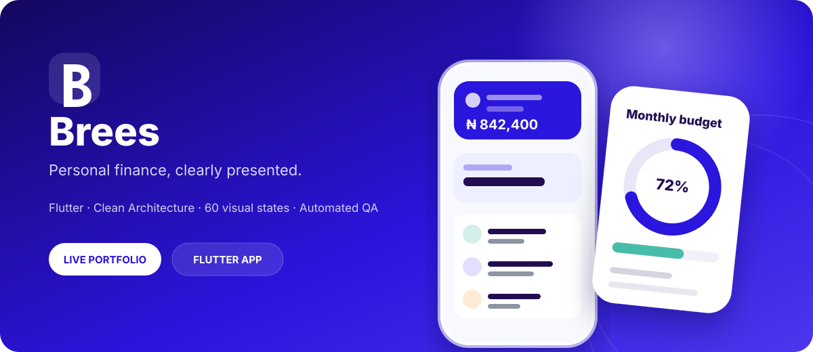

<div align="center">
  
  <p><strong>A polished Flutter personal-finance experience built from a complete Figma product flow.</strong></p>
  <p>60 visual states · Clean Architecture · Motion · Automated visual QA · CI</p>

  <p>
    <a href="https://husseinabozina.github.io/Brees-Mobile-App/">
      
    </a>
    <a href="https://husseinabozina.github.io/Brees-Mobile-App/downloads/brees-demo.apk">
      
    </a>
  </p>

  <p>
    
    
    
    
    <a href="https://github.com/Husseinabozina/Brees-Mobile-App/actions/workflows/flutter_ci.yml">
      
    </a>
  </p>
</div>

<a href="https://husseinabozina.github.io/Brees-Mobile-App/">
  
</a>

## ✨ Product experience

Brees is a complete Flutter implementation of a personal-finance product journey rather than a collection of isolated screens. The app connects onboarding, authentication, account setup, dashboard states, accounts, transactions, budgets, insights, profile, settings, and support into one navigable experience.

<table>
  <tr>
    <td align="center"><br/><sub><strong>Onboarding</strong></sub></td>
    <td align="center"><br/><sub><strong>Authentication</strong></sub></td>
    <td align="center"><br/><sub><strong>Finance dashboard</strong></sub></td>
  </tr>
  <tr>
    <td align="center"><br/><sub><strong>Account details</strong></sub></td>
    <td align="center"><br/><sub><strong>Budgets</strong></sub></td>
    <td align="center"><br/><sub><strong>Insights</strong></sub></td>
  </tr>
</table>

> The screenshots above are captured from the running Flutter implementation and refreshed by CI.

## 🚀 What the app covers

| Area | Experience |
| --- | --- |
| Launch & onboarding | Launch animation, three onboarding screens and guided setup |
| Authentication | Sign up, login, password recovery and verification states |
| Finance home | Balance overview, accounts, recent activity, search and loading states |
| Transactions | History, details, sorting, category actions and advanced filtering |
| Budgets | Empty state, onboarding, configuration, preview, success and active budgets |
| Insights | Financial insight feed and multi-screen report story |
| Profile & support | Profile editing, settings, password, notifications and help centre |

## 🧱 Engineering

The project keeps product UI independent from infrastructure choices through clear feature and domain boundaries.

```text
Presentation
   ↓
Controllers
   ↓
Use cases
   ↓
Repository contracts
   ↓
Repository implementations
   ↓
Remote data sources
   ↓
ApiClient / transport
```

```text
lib/src/
├── app/
│   └── dependencies/
├── core/
│   ├── network/
│   ├── theme/
│   └── widgets/
└── features/
    ├── auth/
    ├── finance/
    ├── onboarding/
    └── system_preview/
```

### Motion & interaction

The implementation includes launch motion, onboarding transitions, animated indicators, verification states, password interactions, dashboard transitions, transaction actions, budget state changes, insight-story transitions, and loading animations.

## ✅ Quality

Every pull request runs:

```bash
flutter analyze
flutter test
flutter test tool/visual_qa_test.dart --reporter expanded
flutter build apk --release
```

The visual-QA harness renders all **60 states** at the target design viewport, captures runtime output, compares it against stored Figma references, and uploads diagnostics for regression review.

## 📱 Try Brees

### Live portfolio
**https://husseinabozina.github.io/Brees-Mobile-App/**

### Android APK
**https://husseinabozina.github.io/Brees-Mobile-App/downloads/brees-demo.apk**

The Android demo build is generated from `main` by GitHub Actions and published with the portfolio.

### Run locally

```bash
git clone https://github.com/Husseinabozina/Brees-Mobile-App.git
cd Brees-Mobile-App
flutter pub get
flutter run
```

## 📚 Project docs

- [Figma screen map](docs/FIGMA_SCREEN_MAP.md)
- [Architecture notes](docs/ARCHITECTURE.md)
- [Backend integration guide](docs/BACKEND_INTEGRATION.md)

## Role & delivery

**Figma analysis → UI reconstruction → navigation → interaction → animation → architecture → data mapping → automated testing → visual QA → CI → portfolio delivery**

<details>
<summary><strong>Design credit</strong></summary>

The visual direction is based on the public **Brees Fintech App UI Kit** on Figma Community. The app branding follows the original **Brees** wordmark treatment shown on the Figma launch screen (`3:1820`). This repository is an independent Flutter implementation created for portfolio and code-review purposes.

</details>

<div align="center">
  <sub>Built with Flutter & Dart.</sub>
</div>
