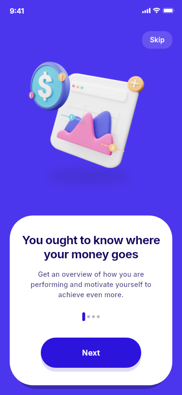
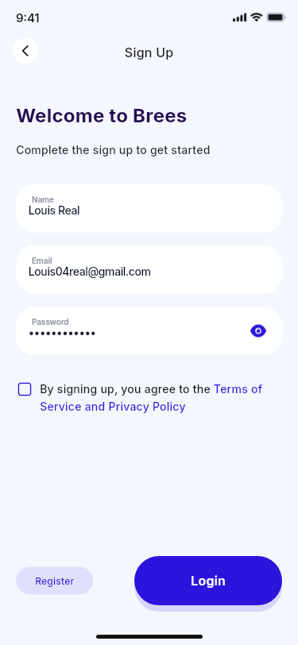
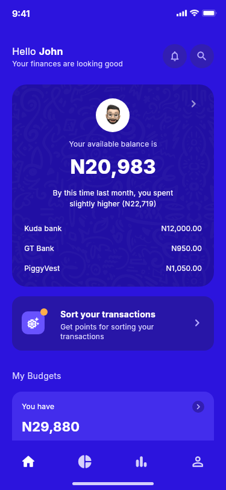
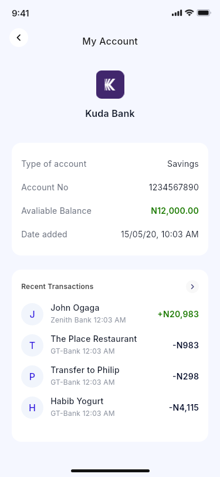
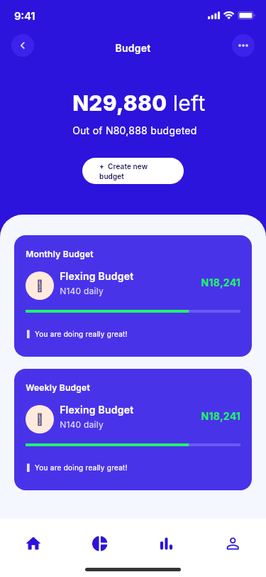
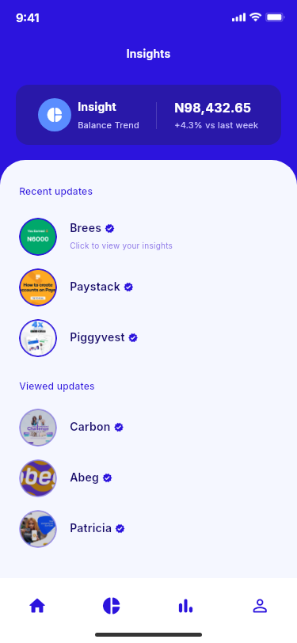
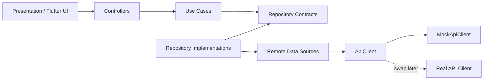

<div align="center">

# Brees Mobile App

**Portfolio-grade Flutter fintech experience rebuilt from the Brees Figma Community UI kit.**

60 visual screens/states · Clean Architecture · Swappable mock backend · Automated visual QA · CI

[](https://github.com/Husseinabozina/Brees-Mobile-App/actions/workflows/flutter_ci.yml)

</div>

> **Design attribution:** the visual direction comes from the public **Brees Fintech App UI Kit** on Figma Community. This repository is an independent Flutter implementation focused on architecture, interaction, motion, testing, and portfolio-quality engineering.

## What I built

I rebuilt the Brees mobile experience in Flutter as a complete portfolio project rather than a collection of static screens.

The implementation covers the full design journey currently exposed in the Figma UI page, including onboarding, authentication, email/browser verification previews, the main finance dashboard, accounts, transactions, filters, budgets, insights, profile, settings, help center, and loading/success states.

On top of the UI implementation, I added:

- a feature-first **Clean Architecture** boundary for business data
- repository contracts and use cases in the domain layer
- transport models and remote data sources in the data layer
- a **mock backend behind an API abstraction**, so a real backend can replace it without rewriting the UI
- stateful interactions and fintech-appropriate animations
- automated widget/regression tests
- a **60-screen visual QA pipeline** that captures Flutter output and compares it with stored Figma references
- GitHub Actions for analysis, tests, visual QA, and portfolio screenshot refresh

## Selected screens

<p align="center">
  
  
  
</p>

<p align="center">
  
  
  
</p>

The gallery above is generated from **real Flutter runtime captures**, not the Figma screenshots. The CI workflow refreshes these showcase images from the visual-QA run.

## Product coverage

| Area | Implemented |
| --- | --- |
| Launch & onboarding | Launch state, three onboarding pages, guided setup |
| Authentication | Sign up, login, forgot password, password reset |
| Verification flow | Email notice, Gmail-style inbox/open-mail preview, browser verification states |
| Finance home | Compact + extended dashboard, loading/welcome/search states |
| Accounts | Account list, balances, account details, recent transactions |
| Transactions | History, details, sorting, category approval/rejection, advanced filtering |
| Budgets | Empty state, intro, configuration, amount, preview, success, active budgets |
| Insights | Insight feed and multi-screen financial report story |
| Profile | Profile, edit profile, settings, password, notifications |
| Support | Help center and topic details |

The complete screen-to-Figma-node map lives in [docs/FIGMA_SCREEN_MAP.md](docs/FIGMA_SCREEN_MAP.md).

## Architecture

The project uses a pragmatic Clean Architecture approach around the business/data features.



### Dependency rule

The domain layer does not know whether data comes from the local mock backend, REST, GraphQL, Supabase, Firebase, or another provider.

Current business-data flow:

```text
Screen
  → Controller
  → Use Case
  → Repository Contract
  → Repository Implementation
  → Remote Data Source
  → ApiClient
  → MockApiClient
```

See [docs/ARCHITECTURE.md](docs/ARCHITECTURE.md) for the detailed rationale.

## Mock backend that is ready to be replaced

The portfolio build does **not** hard-code demo JSON inside the UI.

Instead, the app currently talks to `MockApiClient` through the same boundary a real network client can use.

Implemented mock endpoints:

| Method | Endpoint | Purpose |
| --- | --- | --- |
| `POST` | `/v1/auth/register` | Validate and simulate registration |
| `GET` | `/v1/finance/snapshot` | Accounts, balances and transaction snapshot |

The active dependencies are assembled through `BreesDependencies`.

By default, the app starts with the mock backend. A production-style `RealApiClient` is also implemented and the app root selects it automatically when `BREES_API_BASE_URL` is supplied.

Mock mode:

```bash
flutter run
```

Real-backend mode:

```bash
flutter run \\
  --dart-define=BREES_API_BASE_URL=https://api.example.com
```

At startup, `BreesRuntimeConfig` builds either `BreesDependencies.mock()` or `BreesDependencies.fromApiClient(RealApiClient(...))`. The real adapter already handles JSON requests/responses, request timeouts, Bearer-token injection through an access-token provider, and API/transport failures.

The screens, use cases, repository contracts, and presentation controllers do not need to know that the data source changed.

A step-by-step migration guide is available in [docs/BACKEND_INTEGRATION.md](docs/BACKEND_INTEGRATION.md).

## Project structure

```text
lib/src/
├── app/
│   └── dependencies/          # Composition root / dependency wiring
├── core/
│   ├── network/               # ApiClient, mock API, shared API errors
│   ├── theme/
│   └── widgets/
└── features/
    ├── auth/
    │   ├── data/              # DTOs, data source, repository implementation
    │   ├── domain/            # Entity, repository contract, use case
    │   └── presentation/
    ├── finance/
    │   ├── data/
    │   ├── domain/
    │   └── presentation/
    ├── onboarding/
    └── system_preview/
```

## Motion & interaction work

The design is not implemented as static screenshots. Interactions include:

- launch logo entrance
- onboarding page transitions and animated indicators
- staggered guide-card reveal
- animated email envelope and success states
- browser slide/fade transitions
- floating setup illustration motion
- password visibility and toggle interactions
- dashboard transitions and scroll states
- transaction approve/reject microinteractions
- budget configuration state changes
- insight-story transitions
- animated loading state

## Quality engineering

GitHub Actions currently runs:

```bash
flutter pub get
flutter analyze
flutter test
flutter test tool/visual_qa_test.dart --reporter expanded
```

The visual QA harness:

1. renders the Flutter implementation at the 375 × 812 design viewport
2. captures all 60 implemented visual states
3. compares them with the stored Figma references
4. produces a per-screen diagnostic report
5. uploads the runtime/reference screenshots as a CI artifact
6. refreshes the selected screenshots used in this README

The comparison metric is used as a regression/triage signal; it is **not presented as a claim of perfect pixel equivalence**.

## Engineering decisions

- **Flutter widgets instead of screenshot-based screens** — Figma exports are QA references only.
- **Feature-first structure** — code stays navigable as the project grows.
- **Domain contracts before infrastructure** — backend choice stays replaceable.
- **Runtime backend selection** — `BREES_API_BASE_URL` switches the composition root from mock to real transport without UI changes.
- **Local mock API behind a client interface** — useful portfolio data without coupling presentation to fake repositories.
- **Dedicated system-preview feature** — Gmail/browser demo states do not pollute finance/auth business logic.
- **Animations kept purposeful** — motion supports a finance-product feel rather than becoming decorative noise.

## Run locally

```bash
git clone https://github.com/Husseinabozina/Brees-Mobile-App.git
cd Brees-Mobile-App
flutter pub get
flutter run
```

Recommended viewport for direct Figma comparison: **375 × 812**.

## Tests

The repository contains:

- flow/widget tests for onboarding, auth, finance, account, sorting and navigation
- runtime regression tests across the screen-state map
- mock-backend tests for registration validation and finance JSON → domain mapping
- real HTTP adapter contract tests for JSON, Bearer auth, API errors, and base-URL validation
- automated visual comparison for all 60 states

## My role

This repository demonstrates my work across the full Flutter implementation cycle:

**Figma analysis → UI reconstruction → navigation & interaction → animation → Clean Architecture → mock API/data mapping → testing → visual QA → CI → portfolio presentation.**

It is intentionally structured as a code-reviewable project for Flutter/mobile engineering opportunities, not just a UI clone.

---

<div align="center">

**Built with Flutter and Dart for portfolio / code-review purposes.**

</div>
